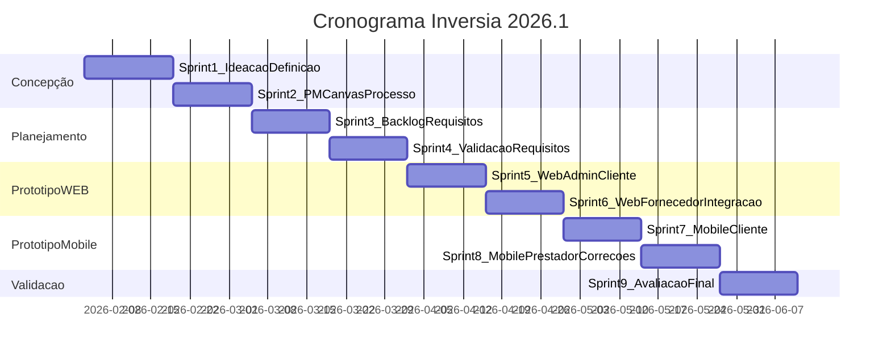

# Planejamento de Sprints — Inversia/ResolvAI

**Projeto:** Inversia Marketplace de Oportunidades (protótipo ResolvAI)  
**Período acadêmico:** 2026.1 (03/02 – 17/06/2026)  
**Documento relacionado:** [PRODUCT_BACKLOG.md](PRODUCT_BACKLOG.md)

---

## Equipe e papéis

| Integrante | Papel principal | Foco de entrega |
|------------|-----------------|-----------------|
| **Danilo** | Product Owner / Gestão | Backlog, sprint planning, PM Canvas, documentação, apresentações |
| **Ygor** | UX/Dev — Visão Contratante | `cliente.html`, `cliente-web.html`, fluxos C1–C11 |
| **Rafael** | UX/Dev — Visão Prestador | `fornecedor.html`, `fornecedor-web.html`, fluxos P1–P9 |
| **Gabriel** | UX/Dev — Admin e Integração | `admim.html`, `index.html`, consistência de dados, correções transversais |

---

## Cadência e premissas

| Premissa | Valor |
|----------|-------|
| Duração da sprint | 2 semanas |
| Dias de aula/review | Terças e quintas |
| Capacidade por sprint | ~20–24 story points |
| Capacidade por integrante | ~5–6 SP/sprint |
| Total de sprints | 9 |
| Story points totais | ~218 SP |
| Escopo do semestre | Concepção + requisitos + protótipos WEB/MOBILE navegáveis |
| Fora de escopo | Backend, APIs reais, deploy em produção |

---

## Cronograma acadêmico de referência

### Fevereiro 2026 — Concepção

| Data | Conteúdo |
|------|----------|
| 03/02 | Definição do projeto · Ideação · Ambientação |
| 05/02 | Definição do projeto · Ferramentas e técnicas · Formação de equipes |
| 10/02 | Definição do projeto · Ideação |
| 12/02 | **Apresentação das ideias para turma** |
| 19/02 | Ideação · Ferramentas e técnicas · Processo de software · Definição do projeto |
| 24/02 | Definição do projeto · Processo de software · Ferramentas e técnicas · Construção do PM Canvas |
| 26/02 | Definição do projeto · Processo de software · Ferramentas e técnicas · Elicitação de requisitos · PM Canvas |

### Março 2026 — Planejamento

| Data | Conteúdo |
|------|----------|
| 03/03 | Planejamento (ciclos, estimativa, métricas) · Gerenciamento de riscos |
| 05/03 | **Avaliação Fase Concepção — Apresentação ao professor** |
| 10/03 | Construção dos ativos metodológicos |
| 12/03 | Escopo e objetivo · Ativos metodológicos · Identificação de requisitos |
| 17/03 | Identificação de requisitos · Escopo e objetivo |
| 24/03 | Identificação de requisitos · Gerenciamento de riscos · Elicitação de requisitos |
| 26/03 | Validação de artefatos · Verificação de requisitos |
| 31/03 | Planejamento · Validação · Verificação · Ativos metodológicos |

### Abril 2026 — Protótipo WEB

| Data | Conteúdo |
|------|----------|
| 07/04 | **Avaliação 1 — Apresentação dos artefatos ao professor** |
| 09/04 – 30/04 | Protótipo WEB de alta fidelidade navegável |

### Maio 2026 — Protótipo MOBILE

| Data | Conteúdo |
|------|----------|
| 05/05 | **Avaliação 2 — Apresentação protótipos WEB** · Protótipo MOBILE |
| 07/05 – 19/05 | Protótipo MOBILE de alta fidelidade navegável |
| 21/05 | **Apresentação protótipos Mobile** · Avaliação dos protótipos · Aprovação da solução |
| 26/05 | Validação de artefatos · Verificação de requisitos |
| 28/05 | **Avaliação 3 — Protótipos web e mobile** |

### Junho 2026 — Validação final

| Data | Conteúdo |
|------|----------|
| 02/06 | Avaliação dos protótipos · Aprovação da solução · **Avaliação 4** |
| 09/06 | Verificação · Validação · Avaliação · Aprovação · **Avaliação 5** |
| 11/06 | Validação · Avaliação · Aprovação · Verificação · **Avaliação 5** |
| 16/06 | **Feedback aos alunos** |
| 17/06 | Fim do período letivo |

---

## Definition of Ready (DoR)

Uma user story está pronta para entrar em sprint quando:

1. Está descrita no formato "Como / Quero / Para" com critérios de aceite testáveis.
2. Possui estimativa em story points acordada pela equipe.
3. Tem responsável designado (Danilo, Ygor, Rafael ou Gabriel).
4. Dependências bloqueantes estão resolvidas ou explicitadas.
5. Está priorizada (MoSCoW) e vinculada a um marco acadêmico.
6. Para stories de protótipo: wireframe ou referência de tela (C/P/A) disponível.

---

## Definition of Done (DoD)

Uma user story está concluída quando:

1. Todos os critérios de aceite foram atendidos.
2. Protótipo navegável testado manualmente no browser (quando aplicável).
3. Documentação atualizada no repositório (quando aplicável).
4. Requisito rastreável à story e à tela correspondente.
5. Revisão por pelo menos 1 outro integrante da equipe.
6. Pronta para demonstração nas datas de avaliação.
7. Sem regressões em fluxos core já entregues.

---

## Visão macro das 9 sprints

| Sprint | Período | Fase | Objetivo | SP | Marco |
|--------|---------|------|----------|-----|-------|
| **1** | 03/02 – 18/02 | Concepção | Ideação e definição do projeto | 20 | Apresentação ideias 12/02 |
| **2** | 19/02 – 04/03 | Concepção | PM Canvas, processo e ferramentas | 22 | PM Canvas 26/02 |
| **3** | 05/03 – 18/03 | Planejamento | Requisitos, backlog e sprint plan | 24 | Avaliação Concepção 05/03 |
| **4** | 19/03 – 01/04 | Planejamento | Refinamento e validação de requisitos | 22 | Prep. Avaliação 1 |
| **5** | 02/04 – 15/04 | Protótipo WEB | Admin + Cliente web (parte 1) | 24 | **Avaliação 1 — 07/04** |
| **6** | 16/04 – 29/04 | Protótipo WEB | Cliente web (parte 2) + Prestador + Admin | 24 | WEB completo |
| **7** | 30/04 – 13/05 | Protótipo MOBILE | Revisão WEB + Cliente mobile | 24 | **Avaliação 2 — 05/05** |
| **8** | 14/05 – 27/05 | Protótipo MOBILE | Prestador mobile + correções | 24 | Mobile 21/05 · **Aval. 3 — 28/05** |
| **9** | 28/05 – 10/06 | Validação | Verificação, correções finais, encerramento | 20 | **Aval. 4/5** · Feedback 16/06 |

---

## Detalhamento sprint a sprint

---

### Sprint 1 — Ideação e Definição do Projeto

| Campo | Detalhe |
|-------|---------|
| **Período** | 03/02 – 18/02/2026 |
| **Fase** | Concepção |
| **Objetivo** | Formalizar a ideia Inversia, formar equipe e apresentar à turma |
| **Capacidade** | 20 SP |
| **Conteúdo acadêmico** | Ideação · Definição do projeto · Formação de equipes |
| **Marco** | Apresentação das ideias — **12/02** |

#### Stories comprometidas

| ID | Story | Responsável | SP |
|----|-------|-------------|-----|
| US-001 | Definir problema e proposta de valor Inversia | Danilo | 3 |
| US-002 | Mapear stakeholders e personas | Danilo | 3 |
| US-003 | Pesquisa de mercado e concorrentes | Rafael | 3 |
| US-004 | Definir escopo inicial do MVP e nicho | Gabriel | 3 |
| US-005 | Formar equipe e definir papéis | Danilo | 2 |
| US-006 | Preparar pitch de apresentação (12/02) | Todos | 3 |
| US-007 | Esboço inicial de jornada do usuário | Ygor | 3 |
| | **Total** | | **20** |

#### Distribuição por integrante

| Integrante | Stories | SP |
|------------|---------|-----|
| Danilo | US-001, US-002, US-005, US-006 | 11 |
| Ygor | US-006, US-007 | 6 |
| Rafael | US-003, US-006 | 6 |
| Gabriel | US-004, US-006 | 6 |

#### Entregáveis

- Pitch de apresentação (12/02)
- Escopo preliminar e personas
- Jornada do usuário esboçada
- Equipe formada com papéis definidos

#### Riscos

- Escopo muito amplo na ideação → mitigar com nicho Fortaleza/manutenção residencial (US-004)

---

### Sprint 2 — PM Canvas, Processo e Ferramentas

| Campo | Detalhe |
|-------|---------|
| **Período** | 19/02 – 04/03/2026 |
| **Fase** | Concepção |
| **Objetivo** | Consolidar visão de produto, processo Scrum e ferramentas |
| **Capacidade** | 22 SP |
| **Conteúdo acadêmico** | Processo de software · Ferramentas e técnicas · Elicitação de requisitos · PM Canvas |
| **Marco** | Construção do PM Canvas — **24/02 e 26/02** |

#### Stories comprometidas

| ID | Story | Responsável | SP |
|----|-------|-------------|-----|
| US-008 | Construir PM Canvas completo | Danilo | 5 |
| US-009 | Definir processo de software (Scrum adaptado) | Danilo | 3 |
| US-010 | Selecionar stack do protótipo (HTML/CSS/JS) | Gabriel | 2 |
| US-011 | Técnicas de elicitação — entrevistas/questionários | Ygor | 3 |
| US-012 | Mapa de stakeholders (Orbital) | Rafael | 3 |
| US-013 | Matriz de riscos inicial | Gabriel | 3 |
| US-014 | Definir paleta de cores e design system | Ygor | 3 |
| | **Total** | | **22** |

#### Distribuição por integrante

| Integrante | Stories | SP |
|------------|---------|-----|
| Danilo | US-008, US-009 | 8 |
| Ygor | US-011, US-014 | 6 |
| Rafael | US-012 | 3 |
| Gabriel | US-010, US-013 | 5 |

#### Entregáveis

- PM Canvas completo
- Matriz de riscos inicial
- Processo Scrum documentado
- Design system (3 visões: azul, laranja, roxo)

#### Dependências

- Sprint 1 concluída (personas, escopo)

---

### Sprint 3 — Planejamento, Requisitos e Product Backlog

| Campo | Detalhe |
|-------|---------|
| **Período** | 05/03 – 18/03/2026 |
| **Fase** | Planejamento |
| **Objetivo** | Formalizar requisitos, gerar backlog e sprint planning |
| **Capacidade** | 24 SP |
| **Conteúdo acadêmico** | Planejamento · Gerenciamento de riscos · Escopo · Identificação de requisitos |
| **Marco** | **Avaliação Fase Concepção — 05/03** |

#### Stories comprometidas

| ID | Story | Responsável | SP |
|----|-------|-------------|-----|
| US-015 | Redigir Declaração de Necessidades | Danilo | 5 |
| US-016 | Identificar requisitos funcionais (13 itens MVP) | Gabriel | 5 |
| US-017 | Identificar requisitos não funcionais | Rafael | 3 |
| US-018 | Gerar Product Backlog | Danilo | 5 |
| US-019 | Gerar Sprint Planning | Danilo | 3 |
| US-020 | Refinar matriz de riscos com mitigações | Gabriel | 3 |
| | **Total** | | **24** |

#### Distribuição por integrante

| Integrante | Stories | SP |
|------------|---------|-----|
| Danilo | US-015, US-018, US-019 | 13 |
| Rafael | US-017 | 3 |
| Gabriel | US-016, US-020 | 8 |

#### Entregáveis

- `DECLARACAO_DE_NECESSIDADES.md`
- `PRODUCT_BACKLOG.md`
- `SPRINT_PLANNING.md`
- Matriz de riscos refinada
- Apresentação Avaliação Concepção (05/03)

#### Riscos

- Avaliação 05/03 no início da sprint → US-015 e PM Canvas (Sprint 2) devem estar prontos antes

---

### Sprint 4 — Refinamento de Requisitos e Validação

| Campo | Detalhe |
|-------|---------|
| **Período** | 19/03 – 01/04/2026 |
| **Fase** | Planejamento |
| **Objetivo** | Validar requisitos, criar wireframes e preparar Avaliação 1 |
| **Capacidade** | 22 SP |
| **Conteúdo acadêmico** | Ativos metodológicos · Verificação de requisitos · Validação de artefatos |
| **Marco** | Preparação **Avaliação 1 — 07/04** |

#### Stories comprometidas

| ID | Story | Responsável | SP |
|----|-------|-------------|-----|
| US-021 | Documentar user stories detalhadas | Danilo | 5 |
| US-022 | Validar requisitos com professor/colegas | Todos | 3 |
| US-023 | Verificar rastreabilidade requisito → story → tela | Gabriel | 3 |
| US-024 | Wireframes de baixa fidelidade (3 visões) | Ygor | 5 |
| US-025 | Estrutura inicial index.html + navegação | Gabriel | 3 |
| US-026 | Preparar apresentação Avaliação 1 (07/04) | Danilo | 3 |
| | **Total** | | **22** |

#### Distribuição por integrante

| Integrante | Stories | SP |
|------------|---------|-----|
| Danilo | US-021, US-022, US-026 | 11 |
| Ygor | US-022, US-024 | 8 |
| Rafael | US-022 | 3 |
| Gabriel | US-022, US-023, US-025 | 9 |

#### Entregáveis

- Wireframes das 3 visões
- `index.html` funcional
- Matriz de rastreabilidade RF → story → tela
- Apresentação Avaliação 1

#### Dependências

- Sprint 3 (backlog e requisitos)

---

### Sprint 5 — Protótipo WEB: Admin + Cliente (Parte 1)

| Campo | Detalhe |
|-------|---------|
| **Período** | 02/04 – 15/04/2026 |
| **Fase** | Protótipo WEB |
| **Objetivo** | Implementar admin parcial e cliente web inicial |
| **Capacidade** | 24 SP |
| **Conteúdo acadêmico** | Protótipo WEB de alta fidelidade navegável |
| **Marco** | **Avaliação 1 — 07/04** |

#### Stories comprometidas

| ID | Story | Responsável | SP | Telas |
|----|-------|-------------|-----|-------|
| US-027 | Admin A1 Dashboard | Gabriel | 5 | A1 |
| US-028 | Admin A2 Gestão de Prestadores | Gabriel | 5 | A2 |
| US-029 | Cliente web C1–C2 | Ygor | 3 | C1–C2 |
| US-030 | Cliente web C3–C4 | Ygor | 5 | C3–C4 |
| US-031 | Cliente web C5 | Ygor | 3 | C5 |
| US-032 | Apresentação Avaliação 1 (07/04) | Danilo | 3 | — |
| | **Total** | | **24** | **8 telas** |

#### Distribuição por integrante

| Integrante | Stories | SP | Arquivo |
|------------|---------|-----|---------|
| Danilo | US-032 | 3 | Apresentação |
| Ygor | US-029, US-030, US-031 | 11 | cliente-web.html |
| Gabriel | US-027, US-028 | 10 | admim.html |

#### Entregáveis

- `admim.html`: telas A1 e A2
- `cliente-web.html`: telas C1–C5
- Demo Avaliação 1 (07/04)

#### Riscos

- Avaliação 07/04 no início da sprint → priorizar US-027 a US-031 na primeira semana

---

### Sprint 6 — Protótipo WEB: Cliente (Parte 2) + Prestador + Integração

| Campo | Detalhe |
|-------|---------|
| **Período** | 16/04 – 29/04/2026 |
| **Fase** | Protótipo WEB |
| **Objetivo** | Completar protótipo WEB das três visões |
| **Capacidade** | 24 SP |
| **Conteúdo acadêmico** | Protótipo WEB (continuação) |
| **Marco** | Protótipo WEB completo — **30/04** |

#### Stories comprometidas

| ID | Story | Responsável | SP | Telas |
|----|-------|-------------|-----|-------|
| US-033 | Cliente web C6–C11 | Ygor | 8 | C6–C11 |
| US-034 | Prestador web P1–P5 | Rafael | 8 | P1–P5 |
| US-035 | Prestador web P6–P9 | Rafael | 5 | P6–P9 |
| US-036 | Admin A3–A6 | Gabriel | 5 | A3–A6 |
| US-037 | Integrar navegação web + consistência | Gabriel | 3 | Todos web |
| | **Total** | | **29** | **20 telas** |

> Sprint com carga elevada (+5 SP) por concentração de entregas WEB; monitorar na retrospectiva da Sprint 5.

#### Distribuição por integrante

| Integrante | Stories | SP | Arquivo |
|------------|---------|-----|---------|
| Ygor | US-033 | 8 | cliente-web.html |
| Rafael | US-034, US-035 | 13 | fornecedor-web.html |
| Gabriel | US-036, US-037 | 8 | admim.html |

#### Entregáveis

- `cliente-web.html` completo (C1–C11)
- `fornecedor-web.html` completo (P1–P9)
- `admim.html` completo (A1–A6)
- Navegação web integrada e dados mock consistentes

#### Dependências

- Sprint 5 (admin parcial, cliente parcial)
- US-014 design system

---

### Sprint 7 — Protótipo MOBILE: Cliente

| Campo | Detalhe |
|-------|---------|
| **Período** | 30/04 – 13/05/2026 |
| **Fase** | Protótipo MOBILE |
| **Objetivo** | Revisar WEB, apresentar Avaliação 2 e iniciar cliente mobile |
| **Capacidade** | 24 SP |
| **Conteúdo acadêmico** | Protótipo WEB (fechamento) · Protótipo MOBILE (início) |
| **Marco** | **Avaliação 2 — 05/05** (protótipos WEB) |

#### Stories comprometidas

| ID | Story | Responsável | SP | Telas |
|----|-------|-------------|-----|-------|
| US-038 | Revisão final protótipo WEB | Todos | 3 | WEB |
| US-039 | Cliente mobile C1–C4 | Ygor | 8 | C1–C4 |
| US-040 | Cliente mobile C5–C7 | Ygor | 8 | C5–C7 |
| US-041 | Apresentação protótipos WEB (05/05) | Danilo | 3 | — |
| US-042 | Documentação parcial do protótipo | Danilo | 5 | documentação.md |
| | **Total** | | **27** | **11 telas** |

> Sprint com carga elevada (+3 SP) devido ao marco Avaliação 2 em 05/05.

#### Distribuição por integrante

| Integrante | Stories | SP |
|------------|---------|-----|
| Danilo | US-041, US-042 | 5 |
| Ygor | US-038, US-039, US-040 | 19 |
| Rafael | US-038 | 1 |
| Gabriel | US-038 | 1 |

#### Entregáveis

- Apresentação Avaliação 2 (05/05)
- `cliente.html`: telas C1–C7
- `documentação.md` parcialmente atualizado

---

### Sprint 8 — Protótipo MOBILE: Prestador + Correções

| Campo | Detalhe |
|-------|---------|
| **Período** | 14/05 – 27/05/2026 |
| **Fase** | Protótipo MOBILE + Validação |
| **Objetivo** | Completar mobile, corrigir problemas críticos e apresentar |
| **Capacidade** | 24 SP |
| **Conteúdo acadêmico** | Protótipo MOBILE · Avaliação dos protótipos |
| **Marco** | Apresentação Mobile **21/05** · **Avaliação 3 — 28/05** |

#### Stories comprometidas

| ID | Story | Responsável | SP | Telas |
|----|-------|-------------|-----|-------|
| US-043 | Cliente mobile C8–C11 | Ygor | 8 | C8–C11 |
| US-044 | Prestador mobile P1–P5 | Rafael | 8 | P1–P5 |
| US-045 | Prestador mobile P6–P9 | Rafael | 5 | P6–P9 |
| US-046 | Correções críticas (navegação, PIX, fluxo) | Gabriel | 5 | Todos |
| US-047 | Unificar dados mock | Gabriel | 3 | Todos |
| US-048 | Apresentação protótipos Mobile (21/05) | Danilo | 3 | — |
| | **Total** | | **32** | **20 telas + correções** |

> Sprint crítica (+8 SP) com marcos duplos (21/05 e 28/05). Se necessário, US-047 pode ser antecipada para o fim da Sprint 7 ou postergada para Sprint 9.

#### Distribuição por integrante

| Integrante | Stories | SP |
|------------|---------|-----|
| Danilo | US-048 | 3 |
| Ygor | US-043 | 8 |
| Rafael | US-044, US-045 | 13 |
| Gabriel | US-046, US-047 | 8 |

#### Entregáveis

- `cliente.html` completo (C1–C11)
- `fornecedor.html` completo (P1–P9)
- Correções de `Correções_Prototipo.txt` (problemas 1–18)
- Apresentação Mobile (21/05)
- Preparação Avaliação 3 (28/05)

#### Mapa de correções (US-046 + US-047)

| Problema | Correção | Responsável |
|----------|----------|-------------|
| 1, 11 | PIX com QR code | Gabriel |
| 2 | Remover boleto | Gabriel |
| 3 | Parcelamento condicional | Gabriel |
| 4, 5 | Acompanhar pedido / aba Pedidos | Ygor + Gabriel |
| 6 | Localização no escopo | Ygor |
| 7 | Scroll smart contract | Ygor |
| 8 | Chat vs verificação contrato | Ygor |
| 9 | Fluxo Escolher C5→C6→C8→C9 | Gabriel |
| 10, 12, 13 | Checkout web | Ygor |
| 14–18 | Dados mock unificados | Gabriel |

---

### Sprint 9 — Validação Final e Encerramento

| Campo | Detalhe |
|-------|---------|
| **Período** | 28/05 – 10/06/2026 |
| **Fase** | Validação |
| **Objetivo** | Verificar requisitos, corrigir feedback e encerrar projeto |
| **Capacidade** | 20 SP |
| **Conteúdo acadêmico** | Verificação de requisitos · Validação de artefatos · Avaliação dos protótipos · Aprovação da solução |
| **Marco** | **Avaliações 4 e 5** (02, 09, 11/06) · **Feedback 16/06** · **Fim 17/06** |

#### Stories comprometidas

| ID | Story | Responsável | SP |
|----|-------|-------------|-----|
| US-049 | Verificar requisitos nos protótipos | Gabriel | 5 |
| US-050 | Validar artefatos com usuários/colegas | Ygor | 3 |
| US-051 | Correções finais pós-avaliação | Rafael | 5 |
| US-052 | Finalizar documentação do repositório | Danilo | 5 |
| US-053 | Apresentação final + feedback 16/06 | Danilo | 3 |
| US-054 | Aprovação da solução — checklist de aprovação | Todos | 2 |
| | **Total** | | **23** |

#### Distribuição por integrante

| Integrante | Stories | SP |
|------------|---------|-----|
| Danilo | US-052, US-053, US-054 | 10 |
| Ygor | US-050, US-054 | 4 |
| Rafael | US-051, US-054 | 7 |
| Gabriel | US-049, US-054 | 7 |

#### Entregáveis

- Relatório de verificação RF-01–RF-13
- Repositório documentado e consolidado
- Apresentação final com feedback incorporado (16/06)
- Checklist de aprovação da solução concluído
- Projeto aprovado para encerramento (17/06)

---

## Matriz de responsabilidades (RACI simplificado)

Legenda: **R** = Responsável · **A** = Aprovador (Danilo/PO) · **C** = Consultado · **I** = Informado

| Atividade | Danilo | Ygor | Rafael | Gabriel |
|-----------|--------|------|--------|---------|
| Product Backlog | R/A | C | C | C |
| Sprint Planning | R/A | C | C | C |
| Declaração de Necessidades | R/A | C | C | C |
| PM Canvas | R/A | C | C | C |
| Protótipo Cliente | C | R | I | C |
| Protótipo Prestador | C | I | R | C |
| Protótipo Admin | C | I | I | R |
| Integração e correções | A | C | C | R |
| Apresentações | R | C | C | C |
| Verificação requisitos | A | C | C | R |
| Documentação final | R/A | C | C | C |

---

## Mapa de dependências entre sprints

```mermaid
flowchart LR
    S1[Sprint1_Ideacao] --> S2[Sprint2_PMCanvas]
    S2 --> S3[Sprint3_Backlog]
    S3 --> S4[Sprint4_Validacao]
    S4 --> S5[Sprint5_WebP1]
    S5 --> S6[Sprint6_WebCompleto]
    S6 --> S7[Sprint7_MobileCliente]
    S7 --> S8[Sprint8_MobilePrestador]
    S8 --> S9[Sprint9_ValidacaoFinal]
```

| Dependência | Bloqueante | Impacto se atrasar |
|-------------|------------|-------------------|
| S1 → S2 | Personas e escopo | PM Canvas incompleto |
| S2 → S3 | PM Canvas e processo | Avaliação Concepção prejudicada |
| S3 → S4 | Backlog e requisitos | Avaliação 1 sem artefatos |
| S4 → S5 | Wireframes e index.html | Protótipo WEB atrasado |
| S5 → S6 | Admin + Cliente parcial | Avaliação 2 comprometida |
| S6 → S7 | WEB completo | Avaliação 2 sem demo completa |
| S7 → S8 | Cliente mobile | Apresentação Mobile incompleta |
| S8 → S9 | Mobile + correções | Avaliações 4/5 prejudicadas |

---

## Carga consolidada por integrante

| Integrante | Sprint 1 | Sprint 2 | Sprint 3 | Sprint 4 | Sprint 5 | Sprint 6 | Sprint 7 | Sprint 8 | Sprint 9 | **Total SP** |
|------------|----------|----------|----------|----------|----------|----------|----------|----------|----------|--------------|
| **Danilo** | 11 | 8 | 13 | 11 | 3 | 0 | 5 | 3 | 10 | **~64** |
| **Ygor** | 6 | 6 | 0 | 8 | 11 | 5 | 19 | 8 | 4 | **~67** |
| **Rafael** | 6 | 3 | 3 | 3 | 0 | 13 | 1 | 13 | 7 | **~49** |
| **Gabriel** | 6 | 5 | 8 | 9 | 10 | 8 | 1 | 8 | 7 | **~62** |

> Totais incluem participação em stories "Todos" (US-006, US-022, US-038, US-054) distribuída proporcionalmente.

---

## Cobertura de telas do protótipo por sprint

| Visão | Telas | Sprint | Responsável | Arquivo |
|-------|-------|--------|-------------|---------|
| Admin | A1–A2 | 5 | Gabriel | admim.html |
| Admin | A3–A6 | 6 | Gabriel | admim.html |
| Cliente WEB | C1–C5 | 5 | Ygor | cliente-web.html |
| Cliente WEB | C6–C11 | 6 | Ygor | cliente-web.html |
| Prestador WEB | P1–P9 | 6 | Rafael | fornecedor-web.html |
| Cliente MOBILE | C1–C7 | 7 | Ygor | cliente.html |
| Cliente MOBILE | C8–C11 | 8 | Ygor | cliente.html |
| Prestador MOBILE | P1–P9 | 8 | Rafael | fornecedor.html |
| Entrada | index | 4 | Gabriel | index.html |
| **Total** | **~46 telas/views** | S4–S8 | Equipe | VisualizacaoPrototipo/ |

---

## Riscos por fase

| Fase | Risco | Probabilidade | Impacto | Mitigação | Sprint |
|------|-------|---------------|---------|-----------|--------|
| Concepção | Ideia genérica demais | Média | Alto | Nicho Fortaleza + manutenção residencial | 1 |
| Planejamento | Backlog inflado | Alta | Alto | MoSCoW rigoroso; Won't para backend | 3 |
| Protótipo WEB | Atraso na Avaliação 1 | Média | Alto | Priorizar US-027–031 na semana 1 | 5 |
| Protótipo WEB | Inconsistência de dados | Alta | Médio | US-037 Sprint 6; US-047 Sprint 8 | 6, 8 |
| Protótipo MOBILE | Extrapolar capacidade Sprint 8 | Alta | Alto | US-047 flexível para Sprint 9 | 8 |
| Validação | Feedback extensivo do professor | Média | Médio | US-051 dedicada; buffer Sprint 9 | 9 |
| Geral | Membro indisponível | Baixa | Alto | Stories documentadas; pareamento | Todas |

---

## Cerimônias Scrum adaptadas

| Cerimônia | Quando | Participantes | Duração |
|-----------|--------|---------------|---------|
| Sprint Planning | 1ª terça da sprint | Todos | 1h (aula) |
| Daily standup (async) | Terças/quintas via chat | Todos | 15 min |
| Sprint Review | Última quinta da sprint | Todos + professor (marcos) | 1h |
| Retrospectiva | Após review | Todos | 30 min |

---
